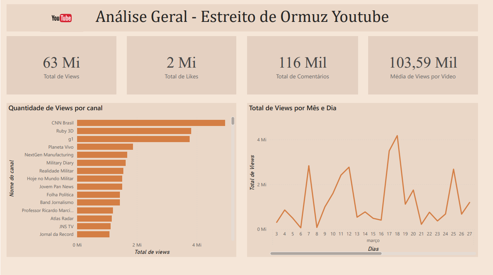
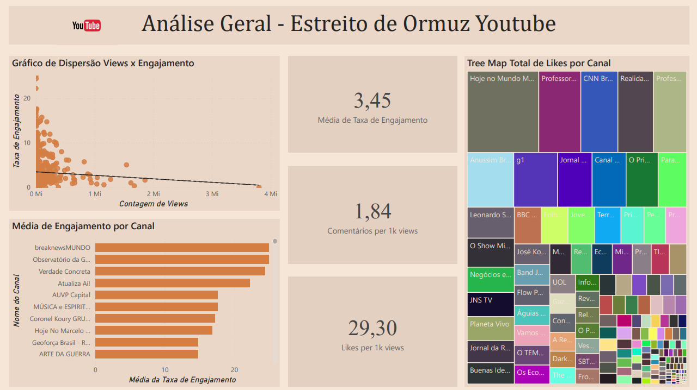

# 📊 Mineração e Análise de Dados do YouTube

Este projeto tem como objetivo coletar, processar e analisar dados do YouTube utilizando sua API oficial, construindo um pipeline de dados estruturado para análises e visualizações futuras.

---

## 🚀 Visão Geral

A aplicação foi desenvolvida com uma arquitetura modular, separando responsabilidades em diferentes camadas:

* **Camada de API**: responsável por se comunicar com a YouTube Data API v3 e coletar dados de vídeos e comentários
* **Camada de Serviço**: responsável pela lógica de negócio e orquestração dos dados
* **Camada de Repositório**: responsável pela persistência dos dados em banco MySQL
* **Camada de Armazenamento**: configuração de conexão com o banco e inicialização do schema

O sistema coleta:

* Metadados de vídeos (título, canal, data de publicação, visualizações, likes, etc.)
* Principais comentários de cada vídeo

Os dados são processados e armazenados diretamente em um banco relacional MySQL, utilizando procedimentos estruturados de ETL e Views para facilitar as consultas.

---

## 🔍 Análises e Resultados (Estudos de Caso)

Para validar o pipeline de dados, foi realizada uma análise exploratória utilizando técnicas de **Redes Complexas** sobre o ecossistema de vídeos do Estreito de Ormuz.

* **Notebook de Análise:** [Exploração de Grafos e Métricas](./Graph_Analysis/analysis_report.ipynb)
* **Relatório Técnico (PDF):** [Análise de Topologia e Disseminação de Conteúdo](https://drive.google.com/file/d/1D6d8h6kJXp0A6Aj7KEshlX1Wy6vgA5Va/view?usp=sharing)

---

## 📈 Dashboard e Relatório Interativo

Os dados armazenados no MySQL foram conectados ao Power BI para geração de KPIs, análise de engajamento e painel de comentários.

### Visão Geral e Engajamento

### Análise Qualitativa

---

## 🧱 Tecnologias Utilizadas

* Python
* YouTube Data API v3
* MySQL
* Pandas
* Power BI
* VSCode

---

## 🔮 Próximas Funcionalidades (Evoluções Futuras)

Funcionalidades planejadas para expansão:

* 🤖 **Processamento de Linguagem Natural (NLP)**

  * Análise de sentimentos em comentários
  * Possível desenvolvimento de um chatbot simples baseado nos dados coletados

* ⚙️ **Melhorias de Escalabilidade**

  * Processamento em lote (batch)
  * Otimização de inserções no banco
  * Uso de Docker para facilitar execução e deploy do projeto

---

## 🎯 Objetivo

O principal objetivo deste projeto é servir como estudo prático de:

* Engenharia de Dados
* Consumo de APIs
* Modelagem e persistência em banco de dados
* Análise e visualização de dados
* Fundamentos de redes complexas

---

## 📌 Observações

Este projeto faz parte de um processo de aprendizado e construção de portfólio, com foco em aplicações reais de coleta, armazenamento e análise de dados.